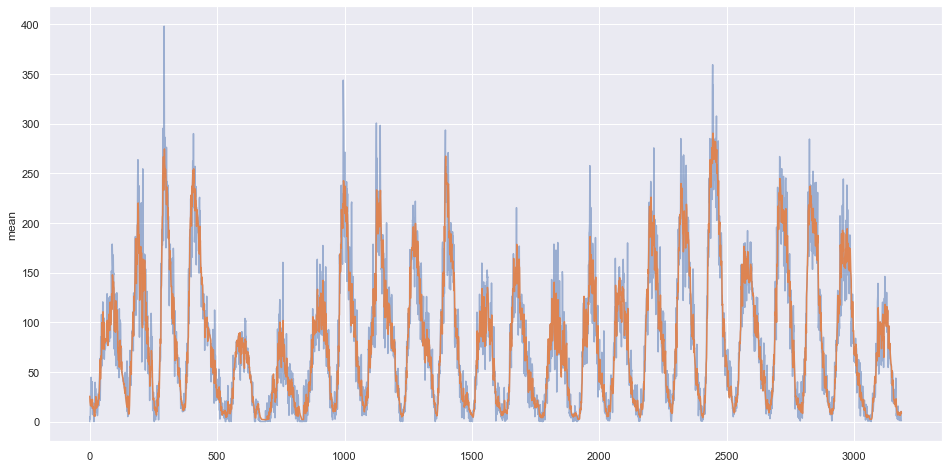

# Sunspots Estimator

A convolutional neural network to predict the monthly average active sunspots
in the Sun. The data is available through the [Y-Space](http://y-space.pw/) API.
The Jupyter Notebook [sunspots-estimator.ipynb](sunspots-estimator.ipynb)
includes the process of creating the dataset and training the model.

The model is defined using a combination of a convolutional layer, LSTM layers,
and dense layers. The output is a single node layer -- the predicted number
of sunspots:

    Model: "sequential"
    _________________________________________________________________
    Layer (type)                 Output Shape              Param #   
    =================================================================
    conv-1 (Conv1D)              (None, None, 32)          192       
    _________________________________________________________________
    lstm-1 (LSTM)                (None, None, 60)          22320     
    _________________________________________________________________
    lstm-2 (LSTM)                (None, None, 60)          29040     
    _________________________________________________________________
    fc-1 (Dense)                 (None, None, 20)          1220      
    _________________________________________________________________
    fc-2 (Dense)                 (None, None, 10)          210       
    _________________________________________________________________
    output (Dense)               (None, None, 1)           11        
    =================================================================
    Total params: 52,993
    Trainable params: 52,993
    Non-trainable params: 0

The following plot illustrates the original values (the blue line) versus the
model predictions (orange line.).

The final version of the model is saved in [sunspots-estimator.h5](sunspots-estimator.h5).

### Acknowledgments

Thank you to Laurence Moroney for the initial bootstrap and motivation.
